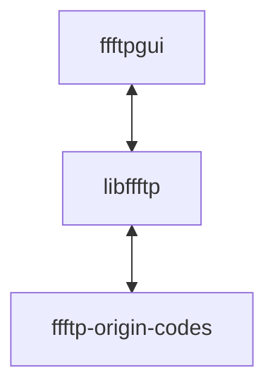

# ffftp (Qt version)

ffftpをQtやPOSIXその他のクロスプラットフォームライブラリを用いて、クロスプラットフォーム化する試み。

## ffftpとlibffftpとffftpguiの関係

ffftpの元のコードをAPIとして集約してライブラリ化(libffftp)する。  
ffftpguiは単にlibffftpのAPIを叩くだけによってffftpの機能を実現する。  
つまりffftpguiからはffftpのコードは完全に隠蔽されるため、GUI部分の開発に集中できる。

## 全体的な思想

1. GUIにはQt6を用いる
2. WindowsでもLinuxでも(Macでも)ビルド可能
3. 最終的なビルドにはQtCreator+CMakeを用いる
4. FTPの通信にはlibcurlを用いる

## デザイン

* 既存のソースはなるべくいじらない
* 既存のソース全体をモジュール化のような感じでライブラリ化して自前で実装するインターフェースを介して情報をやり取りする（GUIと処理は完全に分ける必要がある）
*  

## ロードマップ

1. 仕様・詳細設計の把握（既存コードを熟読する）
2. とりあえず画面をすべてQtに置き換える。同時にffftpの機能をライブラリに順次移行
3. QtCreator(コンパイラはMSVCを使用)でもビルドできるようにビルドシステムにCMakeを追加
4. LLVM MinGWでもビルドできるように頑張る
5. Win32 APIのコードを排除。COMなどを使用する機能は使えなくなる
6. Linuxでもビルドできるように頑張る
7. Mac持っていないけどMacでもビルドできるように頑張る
8. 5.で排除された機能の代替を、その機能が必要かどうかも含めて考える
9. ヘルプファイルをどうするか考える

## 既知の問題

* COMの代替(UPnP) -> https://github.com/pupnp/pupnp が使える？
* concurrent_queue.hがない -> https://github.com/oneapi-src/oneTBB が使える？
* モチベーションの維持
* その他たくさん...
