# ダイアログ

## InputDialog

common.h: 1371

一つの文字列の入力を求めるダイアログを表示する関数。マスターパスワードの入力やユーザー名の入力など一つのテキストの入力を求める。多彩な種類があるためここにまとめておく。

| Dialog-ID | イメージ画像 | 備考 |
| --- | --- | --- |
| account_dlg | 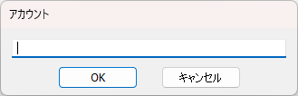 |  |
| chdir_dlg | 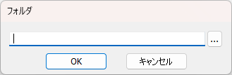 |  |
| downname_dlg | 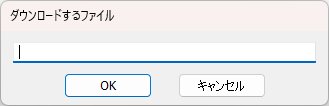 |  |
| find_dlg | 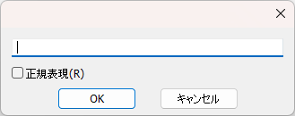 |  |
| fname_in_dlg | 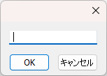 |  |
| forcerename_dlg | 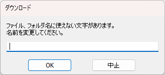 |  |
| group_dlg | 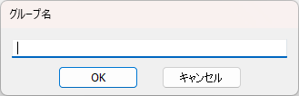 |  |
| masterpasswd_dlg | 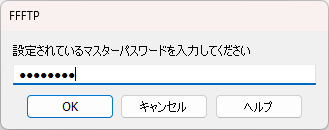 | ヘルプID=64 |
| mkdir_dlg | 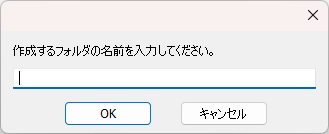 |  |
| newmasterpasswd_dlg | 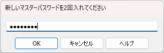 | ヘルプID=64 |
| passwd_dlg | 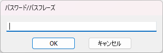 |  |
| re_passwd_dlg | 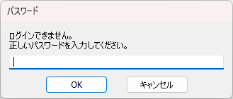 |  |
| somecmd_dlg | 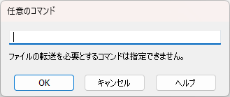 | ヘルプID=23 |
| username_dlg | 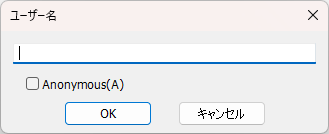 |  |

## Dialog

dialog.h: 163

| Dialog-ID | イメージ画像 | 備考 |
| --- | --- | --- |
| about_dlg |  |  |
| bmark_dlg | 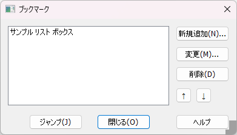 |  |
| bmark_edit_dlg | 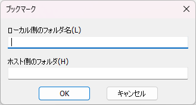 |  |
| certerr_dlg | 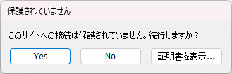 |  |
| chmod_dlg | 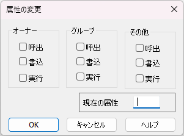 |  |
| corruptsettings_dlg | 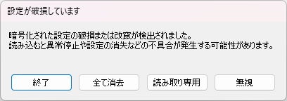 |  |
| cwderr_dlg | 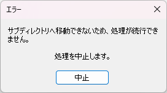 |  |
| def_attr_dlg | 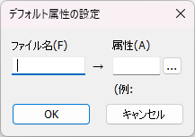 |  |
| delete_dlg | 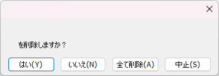 |  |
| down_exist_dlg | 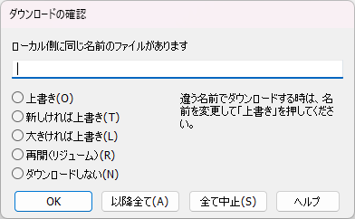 |  |
| downerr_dlg | 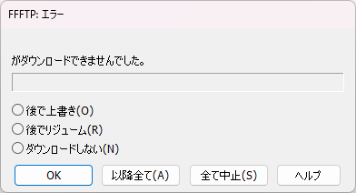 |  |
| exit_dlg | 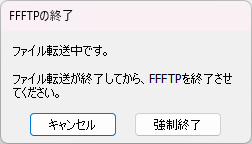 |  |
| filesize_dlg | 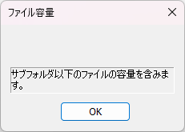 |  |
| filesize_notify_dlg | 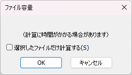 |  |
| filter_dlg | 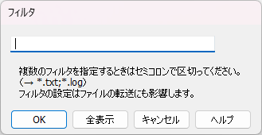 |  |
| forcepasschange_dlg | 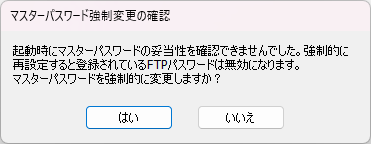 |  |
| groupdel_dlg | 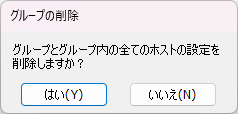 |  |
| hostconnect_dlg | 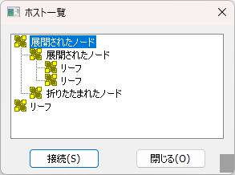 |  |
| hostdel_dlg | 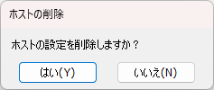 |  |
| hostlist_dlg | 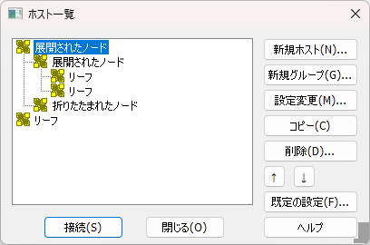 |  |
| hostname_dlg | 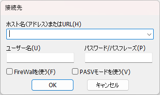 |  |
| ini_from_reg_dlg | 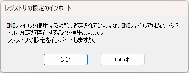 |  |
| mirror_down_dlg | 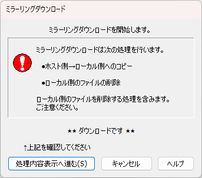 |  |
| mirror_notify_dlg |  |  |
| mirror_up_dlg | 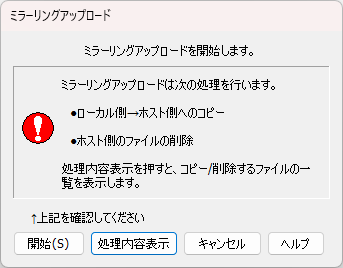 |  |
| mirrordown_notify_dlg | 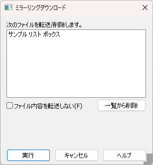 |  |
| move_notify_dlg |  |  |
| noresume_dlg | 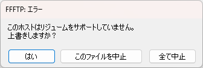 |  |
| otp_calc_dlg | 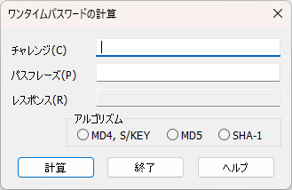 |  |
| otp_notify_dlg |  |  |
| rasnotify_dlg | 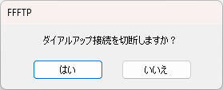 |  |
| rasreconnect_dlg | 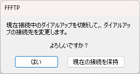 |  |
| reginit_dlg | 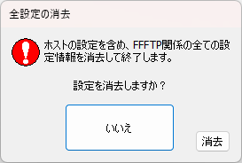 |  |
| rename_dlg | 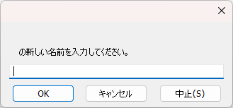 |  |
| savecrypt_dlg | 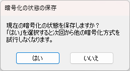 |  |
| savepass_dlg | 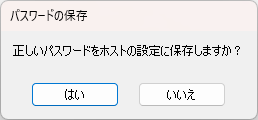 |  |
| sel_local_dlg | 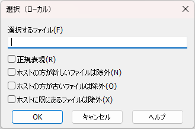 |  |
| sel_remote_dlg |  |  |
| sort_dlg | 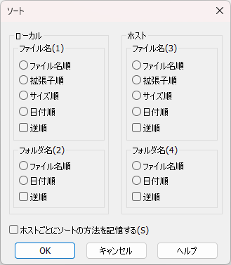 |  |
| transfer_dlg | 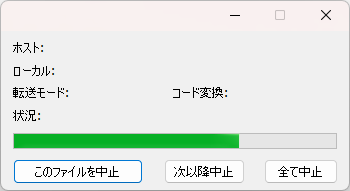 |  |
| up_exist_dlg | 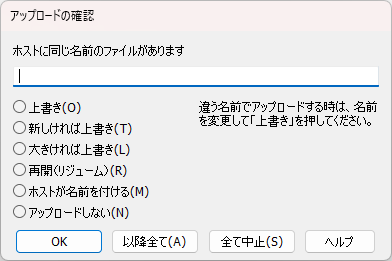 |  |
| updown_as_dlg |  |  |
| updown_as_with_ext_dlg |  |  |
| uperr_dlg |  |  |

## （参考）未使用Dialog

| Dialog-ID | イメージ画像 | 備考 |
| --- | --- | --- |
| chdir_br_dlg |  |  |
| diskfull_dlg |  |  |
| FILEOPENORD_1 |  |  |
| updatesslroot_dlg |  |  |

## （参考）プロパティシートのタブページとして組み込まれるDialog

| Dialog-ID | イメージ画像 | 備考 |
| --- | --- | --- |
| hset_adv_dlg |  |  |
| hset_adv2_dlg |  |  |
| hset_adv3_dlg |  |  |
| hset_code_dlg |  |  |
| hset_crypt_dlg |  |  |
| hset_dialup_dlg |  |  |
| hset_main_dlg |  |  |
| opt_connect_dlg |  |  |
| opt_disp1_dlg |  |  |
| opt_disp2_dlg |  |  |
| opt_fire_dlg |  |  |
| opt_mirror_dlg |  |  |
| opt_misc_dlg |  |  |
| opt_notify_dlg |  |  |
| opt_tool_dlg |  |  |
| opt_trmode1_dlg |  |  |
| opt_trmode2_dlg |  |  |
| opt_trmode3_dlg |  |  |
| opt_trmode4_dlg |  |  |
| opt_user_dlg |  |  |

### 以上
