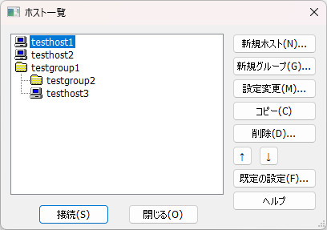
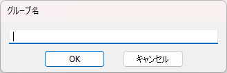
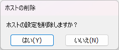
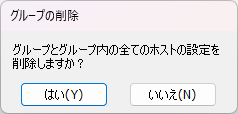

# 「ホスト一覧」ダイアログ 仕様・設計

ホストへの接続情報（以下、ホスト情報）を新規作成したり、ホスト情報の内容を変更したり、不要になったホスト情報を削除したりするためのダイアログ。  
ホスト情報のグルーピングも行うことができる。いわばホスト情報編集ダイアログ。編集だけでなく、実際に接続に使用するホスト情報を選択する機能も有する。

## 目次

* [各UI部品の有効／無効状態](#各ui部品の有効無効状態)
* [「新規ホスト」ボタン](#新規ホストボタン)
* [「新規グループ」ボタン](#新規グループボタン)
* [「設定変更」ボタン](#設定変更ボタン)
* [「コピー」ボタン](#コピーボタン)
* [「削除」ボタン](#削除ボタン)
* [「↑」ボタン](#ボタン)
* [「↓」ボタン](#ボタン-1)
* [「既定の設定」ボタン](#既定の設定ボタン)
* [「接続」ボタン](#接続ボタン)
* [「閉じる」ボタン](#閉じるボタン)
* [「ヘルプ」ボタン](#ヘルプボタン)

## 各UI部品の有効／無効状態

「ホスト一覧」リストにおける、ホストの選択状態によって変化するUI部品の有効／無効(enable/disable)状態を以下に示す。  
表の`UI部品`列に示されていないUI部品（「新規ホスト」「新規グループ」「ヘルプ」「閉じる」の各ボタン）は常に有効とする。  
表の`無効`列が空欄の場合は、有効であることを意味する（無効の場合のみ「無効」と示す）。  
「ホスト一覧」リストが空の場合は何も選択していない状態として扱う。

| ホストの選択状態 | UI部品 | 無効 | 備考 |
| --- | --- | --- | --- |
| 何も選択していない | 「設定変更」ボタン | 無効 |  |
|| 「コピー」ボタン | 無効 |  |
|| 「削除」ボタン | 無効 |  |
|| 「↑」ボタン | 無効 |  |
|| 「↓」ボタン | 無効 |  |
|| 「接続」ボタン | 無効 |  |
| ホストを選択している | 「設定変更」ボタン |  |  |
|| 「コピー」ボタン |  |  |
|| 「削除」ボタン |  |  |
|| 「↑」ボタン |  |  |
|| 「↓」ボタン |  |  |
|| 「接続」ボタン |  |  |
| グループを選択している | 「設定変更」ボタン |  |  |
|| 「コピー」ボタン | 無効 |  |
|| 「削除」ボタン |  |  |
|| 「↑」ボタン |  |  |
|| 「↓」ボタン |  |  |
|| 「接続」ボタン | 無効 |  |

## 「ホスト一覧」リスト

登録されているホスト情報およびそのグループを一覧表示する。表示方法は、ホスト情報をファイルに、グループをフォルダに見立てたディレクトリ構造とする（上記画像参照）。  
項目をクリックすることでその項目を選択することができる。キーボードの上下キーを押下することで選択を上下に移動することができる。

### ホスト情報の表示

アイコンはデスクトップPCのような画像を、項目文字列は[「ホストの設定」ダイアログの「基本」タブ](../host-setting/HOST-SETTING.md#基本タブ)の「ホストの設定名」で設定された文字列を表示する。

### グループの表示

## 「新規ホスト」ボタン

押下することで、デフォルト値を設定した状態の[「ホストの設定」ダイアログ](../host-setting/HOST-SETTING.md)を表示する。  
「ホストの設定」ダイアログでOKボタンが押下された場合は、ダイアログで設定された値でホスト情報を追加する。  
「ホスト一覧」リスト上の追加する位置は、何も選択していない状態であれば先頭に、項目が選択されていればその項目の次である。  
追加した項目を選択状態にする。

## 「新規グループ」ボタン

押下することで、グループ名を入力可能なダイアログ（以下、グループ名入力ダイアログ）を表示する（下記画像参照）。

ループ名入力ダイアログはOKボタンを持ち、押下時には、グループを追加する。  
「ホスト一覧」リスト上の追加する位置は、何も選択していない状態であれば先頭に、項目が選択されていればその項目の次である。  
追加した項目を選択状態にする。  
また、ループ名入力ダイアログはキャンセルボタンを持ち、押下時には、グループの作成処理をキャンセルする。

## 「設定変更」ボタン

押下することで、選択しているホスト情報の値を設定した状態の[「ホストの設定」ダイアログ](../host-setting/HOST-SETTING.md)を表示する。  
「ホストの設定」ダイアログでOKボタンが押下された場合は、ダイアログで設定された値でホスト情報を更新する。

## 「コピー」ボタン

押下することで、選択しているホスト情報の値でホスト情報を追加する。  
以下、[「新規ホスト」ボタン](#新規ホストボタン)と同様。

## 「削除」ボタン

押下することで、削除の確認のダイアログを表示する。承諾された場合、選択している項目を削除する。  
選択している項目がグループの場合は、そのグループに所属するホスト情報・グループをすべて削除する。

## 「↑」ボタン

押下することで、選択している項目を「ホスト一覧」リスト上のひとつ上へ移動する。  
ひとつ上の項目がグループの場合は、そのグループの一番下へ移動する。

## 「↓」ボタン

押下することで、選択している項目を「ホスト一覧」リスト上のひとつ下へ移動する。  
ひとつ下の項目がグループの場合は、そのグループの一番上へ移動する。

## 「既定の設定」ボタン

押下することで、デフォルト値を設定した状態の[「ホストの設定」ダイアログ](../host-setting/HOST-SETTING.md)を表示する。  
「ホストの設定」ダイアログでOKボタンが押下された場合は、ダイアログで設定された値でデフォルト値を更新する。

## 「接続」ボタン

押下することで、このダイアログを閉じ、選択しているホスト情報で接続処理を実行する。  
「ホスト一覧」リストでホストをダブルクリックした場合も、同様の処理を行う。

## 「閉じる」ボタン

押下することで、このダイアログを閉じる。  

## 「ヘルプ」ボタン

押下することで、ヘルプID`27`のヘルプを表示する。

### 以上
