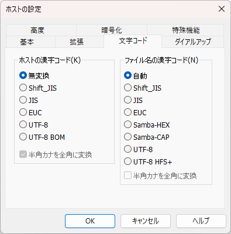

# 「ホストの設定」ダイアログ 仕様・設計

接続先リストを編集するダイアログ。

これはダイアログというか正確にはプロパティシート。Win32 APIのPropertySheetW関数を利用して生成している。  
なのでリソースファイル(*.rc)には「ホストの設定」というキャプションのダイアログは定義されていない。

UI部品設定値のデフォルト値について、デフォルト値はエンドユーザーが設定できる仕様になっている。  
一度もエンドユーザーに設定されていないデフォルト値（つまり、デフォルト値のデフォルト値）を含め、デフォルト値はアプリ側(ffftp)から提供される。  
従ってデフォルト値の仕様の解析は行わない。ただし、一部のUI部品については固定のデフォルト値が採用されているためそれについてはその限りではない。

変数の型について

| | 文字列系 | チェックボックス | コンボボックス |
| --- | --- | --- | --- |
| ffftp | std::wstring | int (YES=ON, NO=OFF) | int (先頭選択時=0) |
| libffftp | wchar_t* | bool (true=ON, false=OFF) | int (先頭選択時=0) |
| ffftpgui | std::wstring | bool (true=ON, false=OFF) | int (先頭選択時=0) |

(YES, NOは#defineで定義されている)

「ヘルプ」ボタン押下時、HTMLヘルプを表示する。

## 目次

* [「基本」タブ](#基本タブ)
* [「拡張」タブ](#拡張タブ)
* [「文字コード」タブ](#文字コードタブ)
* [「ダイアルアップ」タブ](#ダイアルアップタブ)
* [「高度」タブ](#高度タブ)
* [「暗号化」タブ](#暗号化タブ)
* [「特殊機能」タブ](#特殊機能タブ)
* [ヘルプID](#ヘルプid)

## 「基本」タブ

関連するシンボル名とそのソースファイル名: struct General (hostman.cpp:943)


### 各部品の値を保持している変数名およびそれに関連する変数名(1)

| UI部品 | 変数名(ffftp) | 変数名(libffftp) | 変数名(ffftpgui) | 備考 |
| --- | --- | --- | --- | --- |
| ホストの設定名 | HOSTDATA::HostName | hostdata::hostdata_general::host_name | HostSettingGeneralForm::Data::host_name | 上限文字数=40 |
| ホスト名 | HOSTDATA::HostAdrs | hostdata::hostdata_general::host_adrs | HostSettingGeneralForm::Data::host_adrs | 上限文字数=80 |
| ユーザー名 | HOSTDATA::UserName | hostdata::hostdata_general::username | HostSettingGeneralForm::Data::username | 上限文字数=80 |
| パスワード | HOSTDATA::PassWord | hostdata::hostdata_general::password | HostSettingGeneralForm::Data::password | 上限文字数=80 |
| anonymous | HOSTDATA::Anonymous | hostdata::hostdata_general::anonymous | HostSettingGeneralForm::Data::anonymous | - |
| ローカルの初期フォルダ | HOSTDATA::LocalInitDir | hostdata::hostdata_general::initdir_local | HostSettingGeneralForm::Data::initdir_local | 上限文字数=1024-40=984 |
| ホストの初期フォルダ | HOSTDATA::RemoteInitDir | hostdata::hostdata_general::initdir_remote | HostSettingGeneralForm::Data::initdir_remote | 上限文字数=1024-40=984 |
| 現在のフォルダ | AskRemoteCurDir()関数で取得可能 | hostdata::hostdata_general::initdir_remote_now, hostdata::hostdata_general::enabled_curdir | HostSettingGeneralForm::Data::initdir_remote_now, HostSettingGeneralForm::Data::enabled_curdir | カレントディレクトリパス文字列を保持[(参照)](#現在のフォルダボタン) |
| 最後にアクセスした～ | HOSTDATA::LastDir | hostdata::hostdata_general::last_dir | HostSettingGeneralForm::Data::last_dir | - |

### 「anonymous」チェックボックス

OFFからONにしたとき、以下の通り、値を書き換える。

| ユーザー名 | パスワード |
| --- | --- |
| anonymous | who\@example.com |

ONからOFFにしたとき、ONしたときに入力されていた「ユーザー名」および「パスワード」をそれぞれ書き戻す。

### 「...」ボタン

押下時、フォルダ選択ダイアログを表示し「ローカルの初期フォルダ」に選択したフォルダへの絶対パスを表示する。  

### 「現在のフォルダ」ボタン

リモート先に接続状態でない(`enabled_curdir==false`)ときは、Disableとする。  
押下時、リモート側のカレントディレクトリパスを「ホストの初期フォルダ」に表示する。

### 「OK」ボタン(1)

* 各文字列型の変数について、前後の連続する空欄があれば削除する。
* 「ホストの設定名」が空かつ「ホスト名」が空でなければ「ホストの設定名」を「ホスト名」とする。
* その逆、「ホストの設定名」が空でない、かつ「ホスト名」が空であれば「ホスト名」と「ホストの設定名」する。

### その他1

* 現在の仕様だと、「ホストの設定名」および「ホスト名」が両方空でも設定できてしまう。

## 「拡張」タブ

関連するシンボル名とそのソースファイル名: struct Advanced (hostman.cpp:1015)


### 各部品の値を保持している変数名およびそれに関連する変数名(2)

| UI部品 | 変数名(ffftp) | 変数名(libffftp) | 変数名(ffftpgui) | 備考 |
| --- | --- | --- | --- | --- |
| FireWallを使う | HOSTDATA::FireWall | hostdata::hostdata_advanced::firewall | HostSettingAdvancedForm::Data::firewall |  |
| PASVモードを使う | HOSTDATA::Pasv | hostdata::hostdata_advanced::pasv | HostSettingAdvancedForm::Data::pasv |  |
| フォルダ同時移動を使う | HOSTDATA::SyncMove | hostdata::hostdata_advanced::syncmove | HostSettingAdvancedForm::Data::syncmove |  |
| ポート番号 | HOSTDATA::Port | hostdata::hostdata_advanced::port | HostSettingAdvancedForm::Data::port | 上限文字数=5 |
| アカウント | HOSTDATA::Account | hostdata::hostdata_advanced::account | HostSettingAdvancedForm::Data::account | 上限文字数=80 |
| ホストのタイムゾーン | HOSTDATA::TimeZone | hostdata::hostdata_advanced::timezone | HostSettingAdvancedForm::Data::timezone |  |
| セキュリティ | HOSTDATA::Security | hostdata::hostdata_advanced::security | HostSettingAdvancedForm::Data::security |  |
| 接続時にホストに送るコマンド | HOSTDATA::InitCmd | hostdata::hostdata_advanced::initcmd | HostSettingAdvancedForm::Data::initcmd | 上限文字数=256 |

### 「標準」ボタン

押下時「ポート番号」テキストボックスを`21`に書き換える。

### 「ホストのタイムゾーン」コンボボックス

リストは以下の通り:

```text
GMT-12:00
GMT-11:00
GMT-10:00
GMT-09:00
GMT-08:00
GMT-07:00
GMT-06:00
GMT-05:00
GMT-04:00
GMT-03:00
GMT-02:00
GMT-01:00
GMT
GMT+01:00
GMT+02:00
GMT+03:00
GMT+04:00
GMT+05:00
GMT+06:00
GMT+07:00
GMT+08:00
GMT+09:00 (日本)
GMT+10:00
GMT+11:00
GMT+12:00
```

### 「セキュリティ」コンボボックス

リストは以下の通り:

```text
使用しない
自動認識
OTP MD4, S/KEY
OTP MD5
OTP SHA-1
```

## 「文字コード」タブ

関連するシンボル名とそのソースファイル名: struct KanjiCode (hostman.cpp:1067)



### 各部品の値を保持している変数名およびそれに関連する変数名(3)

| UI部品 | 変数名(ffftp) | 変数名(libffftp) | 変数名(ffftpgui) | 備考 |
| --- | --- | --- | --- | --- |
| **ホストの漢字コード** |  |  |  |  |
| 無変換 | HOSTDATA::KanjiCode==KANJI_NOCNV | hostdata::hostdata_kanjicode::kanjicode==KC_NOP | HostSettingKanjiCodeForm::Data::kanjicode==kNOP |  |
| Shift_JIS | HOSTDATA::KanjiCode==KANJI_SJIS | hostdata::hostdata_kanjicode::kanjicode==KC_SJIS | HostSettingKanjiCodeForm::Data::kanjicode==kSJIS |  |
| JIS | HOSTDATA::KanjiCode==KANJI_JIS | hostdata::hostdata_kanjicode::kanjicode==KC_JIS | HostSettingKanjiCodeForm::Data::kanjicode==kJIS |  |
| EUC | HOSTDATA::KanjiCode==KANJI_EUC | hostdata::hostdata_kanjicode::kanjicode==KC_EUC | HostSettingKanjiCodeForm::Data::kanjicode==kEUC |  |
| UTF-8 | HOSTDATA::KanjiCode==KANJI_UTF8N | hostdata::hostdata_kanjicode::kanjicode==KC_UTF8N | HostSettingKanjiCodeForm::Data::kanjicode==kUTF8N |  |
| UTF-8 BOM | HOSTDATA::KanjiCode==KANJI_UTF8BOM | hostdata::hostdata_kanjicode::kanjicode==KC_UTF8BOM | HostSettingKanjiCodeForm::Data::kanjicode==kUTF8BOM |  |
| 半角カナを全角に変換 | HOSTDATA::KanaCnv | hostdata::hostdata_kanjicode::kanacnv | HostSettingKanjiCodeForm::Data::kanacnv | Shift_JIS,JIS,EUC選択時のみEnable |
| **ファイル名の漢字コード** |  |  |  |  |
| 自動 | HOSTDATA::NameKanjiCode==KANJI_AUTO | hostdata::hostdata_kanjicode::kanjicode_name==KC_AUTO | HostSettingKanjiCodeForm::Data::kanjicode_name==kAUTO |  |
| Shift_JIS | HOSTDATA::NameKanjiCode==KANJI_SJIS | hostdata::hostdata_kanjicode::kanjicode_name==KC_SJIS | HostSettingKanjiCodeForm::Data::kanjicode_name==kSJIS |  |
| JIS | HOSTDATA::NameKanjiCode==KANJI_JIS | hostdata::hostdata_kanjicode::kanjicode_name==KC_JIS | HostSettingKanjiCodeForm::Data::kanjicode_name==kJIS |  |
| EUC | HOSTDATA::NameKanjiCode==KANJI_EUC | hostdata::hostdata_kanjicode::kanjicode_name==KC_EUC | HostSettingKanjiCodeForm::Data::kanjicode_name==kEUC |  |
| Samba-HEX | HOSTDATA::NameKanjiCode==KANJI_SMB_HEX | hostdata::hostdata_kanjicode::kanjicode_name==KC_SMH | HostSettingKanjiCodeForm::Data::kanjicode_name==kSMH |  |
| Samba-CAP | HOSTDATA::NameKanjiCode==KANJI_SMB_CAP | hostdata::hostdata_kanjicode::kanjicode_name==KC_SMC | HostSettingKanjiCodeForm::Data::kanjicode_name==kSMC |  |
| UTF-8 | HOSTDATA::NameKanjiCode==KANJI_UTF8N | hostdata::hostdata_kanjicode::kanjicode_name==KC_UTF8N | HostSettingKanjiCodeForm::Data::kanjicode_name==kUTF8N |  |
| UTF-8 HFS+ | HOSTDATA::NameKanjiCode==KANJI_UTF8HFSX | hostdata::hostdata_kanjicode::kanjicode_name==KC_UTF8HFSX | HostSettingKanjiCodeForm::Data::kanjicode_name==kUTF8HFSX |  |
| 半角カナを全角に変換 | HOSTDATA::NameKanaCnv | hostdata::hostdata_kanjicode::kanacnv_name | HostSettingKanjiCodeForm::Data::kanacnv_name | JIS,EUC選択時のみEnable |

## 「ダイアルアップ」タブ

関連するシンボル名とそのソースファイル名: struct Dialup (hostman.cpp:1121)


### 各部品の値を保持している変数名およびそれに関連する変数名(4)

| UI部品 | 変数名(ffftp) | 変数名(libffftp) | 変数名(ffftpgui) | 備考 |
| --- | --- | --- | --- | --- |
| ダイアルアップで接続する | HOSTDATA::Dialup | hostdata::hostdata_dialup::dialup | HostSettingDialupForm::Data::dialup |  |
| 接続する電話帳エントリ | HOSTDATA::DialEntry | hostdata::hostdata_dialup::dialup_entry | HostSettingDialupForm::Data::dialup_entry | 文字列型とする |
| 別のエントリへ接続中でも上記へ接続しなおす | HOSTDATA::DialupAlways | hostdata::hostdata_dialup::dialup_always | HostSettingDialupForm::Data::dialup_always |  |
| 接続しなおす際に確認する | HOSTDATA::DialupNotify | hostdata::hostdata_dialup::dialup_notify | HostSettingDialupForm::Data::dialup_notify |  |

### 全UI部品共通事項

「RASの制御を行わない」チェックボックス（オプションダイアログの「接続/切断」タブ）がONの時、または、  
「ダイアルアップで接続する」チェックボックスがOFFの時、Disableとする。

### 「ダイアルアップで接続する」チェックボックス

「RASの制御を行わない」チェックボックス（オプションダイアログの「接続/切断」タブ）がONの時、チェックをOFFとする。

### 「接続しなおす際に確認する」チェックボックス

「別のエントリへ接続中でも上記へ接続しなおす」チェックボックスがOFFのとき、Disableとする。

### 「接続する電話帳エントリ」コンボボックス

Win32 APIを使用してリストを構築している。詳しくは SetRasEntryToComboBox() 関数参照。

## 「高度」タブ

関連するシンボル名とそのソースファイル名: struct Special (hostman.cpp:1177)


### 各部品の値を保持している変数名およびそれに関連する変数名(5)

| UI部品 | 変数名(ffftp) | 変数名(libffftp) | 変数名(ffftpgui) | 備考 |
| --- | --- | --- | --- | --- |
| LISTコマンドでファイル一覧を取得 | HOSTDATA::ListCmdOnly | hostdata::hostdata_special::list_cmd_only | HostSettingSpecialForm::Data::list_cmd_only |  |
| 可能であればMLSDコマンドで一覧を取得 | HOSTDATA::UseMLSD | hostdata::hostdata_special::use_mlsd | HostSettingSpecialForm::Data::use_MLSD |  |
| NLST -R を使って高速に再帰検索 | HOSTDATA::UseNLST_R | hostdata::hostdata_special::use_nlst_r | HostSettingSpecialForm::Data::use_NLST_R |  |
| フルパスでファイルをアクセスしない | HOSTDATA::NoFullPath | hostdata::hostdata_special::no_fullpath | HostSettingSpecialForm::Data::no_fullpath |  |
| 属性変更コマンド | HOSTDATA::ChmodCmd | hostdata::hostdata_special::chmod_cmd | HostSettingSpecialForm::Data::chmod_cmd | 上限文字数=40 |
| ホストの種類 | HOSTDATA::HostType | hostdata::hostdata_special::host_type | HostSettingSpecialForm::Data::host_type |  |
| NLSTファイル名/オプション | HOSTDATA::LsName | hostdata::hostdata_special::ls_name | HostSettingSpecialForm::Data::ls_name | 上限文字数=40 |

### 「LISTコマンドでファイル一覧を取得」チェックボックス

本チェックボックスがONの時、「NLST -R を使って高速に再帰検索」チェックボックスをDisableとし、  
そうでなければ、「可能であればMLSDコマンドで一覧を取得」チェックボックスをDisableとする。

### 「ホストの種類」コンボボックス

リストは以下の通り:

```text
自動認識
ACOS
VAX VMS
IRMX
ACOS-4
Stratus
Agilent Logic Analyzer
シバソク WL
NonStop Server
```

`VAX VMS`(=2)選択時、

* 「LISTコマンドでファイル一覧を取得」チェックボックスをDisableとする。
* 「NLST -R を使って高速に再帰検索」チェックボックスをDisableとする。
* 「フルパスでファイルをアクセスしない」チェックボックスをDisableとする。

`NonStop Server`(=8)選択時、

* 「LISTコマンドでファイル一覧を取得」チェックボックスをONとする。
* 「LISTコマンドでファイル一覧を取得」チェックボックスをDisableとする。
* 「NLST -R を使って高速に再帰検索」チェックボックスをDisableとする。
* 「フルパスでファイルをアクセスしない」チェックボックスをDisableとする。

それ以外([0-1,3-7])の選択時、「LISTコマンドでファイル一覧を取得」チェックボックスのチェックがOFFなら、  

* 「NLST -R を使って高速に再帰検索」チェックボックスをDisableとする。

※ 「Disableとする」と明記していないUI部品はすべてEnableとする。

### 「標準」ボタン（「属性変更コマンド」）

「属性変更コマンド」テキストボックスを`SITE CHMOD`に書き換える。

### 「標準」ボタン（「NLSTファイル名/オプション」）

「NLSTファイル名/オプション」テキストボックスを`-alL`に書き換える。

## 「暗号化」タブ

関連するシンボル名とそのソースファイル名: struct Encryption (hostman.cpp:1281)


### 各部品の値を保持している変数名およびそれに関連する変数名(6)

| UI部品 | 変数名(ffftp) | 変数名(libffftp) | 変数名(ffftpgui) | 備考 |
| --- | --- | --- | --- | --- |
| 暗号化なしで接続を許可 | HOSTDATA::UseNoEncryption | hostdata::hostdata_encryption::use_no_encryption | HostSettingEncryptionForm::Data::use_no_encryption |  |
| FTPS (Explicit)で接続 | HOSTDATA::UseFTPES | hostdata::hostdata_encryption::use_ftp_es | HostSettingEncryptionForm::Data::use_ftp_es |  |
| FTPS (Implicit)で接続 | HOSTDATA::UseFTPIS | hostdata::hostdata_encryption::use_ftp_is | HostSettingEncryptionForm::Data::use_ftp_is |  |

## 「特殊機能」タブ

関連するシンボル名とそのソースファイル名: struct Feature (hostman.cpp:1305)


### 各部品の値を保持している変数名およびそれに関連する変数名(7)

| UI部品 | 変数名(ffftp) | 変数名(libffftp) | 変数名(ffftpgui) | 備考 |
| --- | --- | --- | --- | --- |
| 最大同時接続数 | HOSTDATA::MaxThreadCount | hostdata::hostdata_feature::max_thread_cnt | HostSettingFeatureForm::Data::max_thread_cnt | 上限文字数=1, int型, 入力可能範囲=1-4 |
| メインウィンドウのソケットを再利用 | HOSTDATA::ReuseCmdSkt | hostdata::hostdata_feature::reuse_cmdsocket | HostSettingFeatureForm::Data::reuse_cmdsocket |  |
| PASVで返されるアドレスを無視 | HOSTDATA::NoPasvAdrs | hostdata::hostdata_feature::no_pasv_adrs | HostSettingFeatureForm::Data::no_pasv_adrs |  |
| 接続維持用コマンド周期 | HOSTDATA::NoopInterval | hostdata::hostdata_feature::noop_interval | HostSettingFeatureForm::Data::noop_interval | 上限文字数=3, int型, 入力可能範囲=0-300 |
| 転送エラー時の処理 | HOSTDATA::TransferErrorNotify, HOSTDATA::TransferErrorMode | hostdata::hostdata_feature::error_mode | HostSettingFeatureForm::Data::error_mode |  |
| 転送エラー後に再接続 | HOSTDATA::TransferErrorReconnect | hostdata::hostdata_feature::reconnect | HostSettingFeatureForm::Data::reconnect |  |

### 「転送エラー時の処理」コンボボックス

リストと対応する変数の値は以下の通り:

| リスト文字列 | HOSTDATA::TransferErrorNotify | HOSTDATA::TransferErrorModeの値 | 各error_modeの値 |
| --- | --- | --- | --- |
| 毎回尋ねる | YES | EXIST_OVW | 0 |
| 全て後で上書き | NO | EXIST_OVW | 1 |
| 全て後でリジューム | NO | EXIST_RESUME | 2 |
| 全てスキップ | NO | EXIST_IGNORE | 3 |

## ヘルプID

各タブに対応するヘルプIDを以下に示す。ヘルプ押下時、下記の表のとおり、表示しているタブに対応するヘルプIDをもととしたHTMLヘルプを表示する。

| タブ | ヘルプID |
| --- | --- |
| 「基本」タブ | 28 |
| 「拡張」タブ | 29 |
| 「文字コード」タブ | 30 |
| 「ダイアルアップ」タブ | 31 |
| 「高度」タブ | 32 |
| 「暗号化」タブ | 65 |
| 「特殊機能」タブ | 66 |

### 以上
