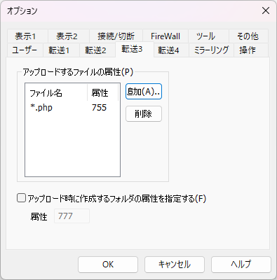
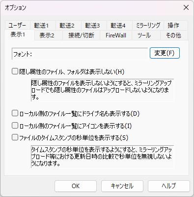

# 「オプション」ダイアログ 仕様・設計

オプションを編集するダイアログ。メニュー「オプション」→「環境設定」を押下することで表示される。

変数の型について

| | 文字列系 | チェックボックス | コンボボックス |
| --- | --- | --- | --- |
| ffftp | std::wstring | int (YES=ON, NO=OFF) | int (先頭選択時=0) |
| libffftp | wchar_t* | bool (true=ON, false=OFF) | int (先頭選択時=0) |
| ffftpgui | std::wstring | bool (true=ON, false=OFF) | int (先頭選択時=0) |

(YES, NOは#defineで定義されている)

「ヘルプ」ボタン押下時、HTMLヘルプを表示する。

## 目次

* [「ユーザー」タブ](#ユーザータブ)
* [「転送1」タブ](#転送1タブ)
* [「転送2」タブ](#転送2タブ)
* [「転送3」タブ](#転送3タブ)
* [「転送4」タブ](#転送4タブ)
* [「ミラーリング」タブ](#ミラーリングタブ)

## 「ユーザー」タブ

関連するシンボル名とそのソースファイル名: struct User (option.cpp:82)


### 各部品の値を保持している変数名およびそれに関連する変数名(01)

| UI部品 | 変数名(ffftp) | 変数名(libffftp) | 変数名(ffftpgui) | 備考 |
| --- | --- | --- | --- | --- |
| メールアドレス | UserMailAdrs | option::option_user::user_mail_adrs | OptionUserForm::Data::user_mail_adrs | 上限文字数=80 |

## 「転送1」タブ

関連するシンボル名とそのソースファイル名: struct Transfer1 (option.cpp:103)


### 各部品の値を保持している変数名およびそれに関連する変数名(02)

| UI部品 | 変数名(ffftp) | 変数名(libffftp) | 変数名(ffftpgui) | 備考 |
| --- | --- | --- | --- | --- |
| 常にアスキーモード | TmpTransMode=TRMODE_ASCII | option::option_transfer1::trans_mode=ASCII | OptionTransfer1Form::Data::trans_mode=kASCII |  |
| 常にバイナリモード | TmpTransMode=TRMODE_BIN | option::option_transfer1::trans_mode=BINARY | OptionTransfer1Form::Data::trans_mode=kBinary |  |
| ファイル名で切り替え | TmpTransMode=TRMODE_AUTO | option::option_transfer1::trans_mode=AUTO | OptionTransfer1Form::Data::trans_mode=kAuto |  |
| アスキーモードのファイル名 | AsciiExt | option::option_transfer1::ascii_ext, ascii_ext_cnt | OptionTransfer1Form::Data::ascii_ext | 文字列のvector系 |
| アスキーモードでアップロード時、EOF(Ctrl-Z)を取り除く | RmEOF | option::option_transfer1::rm_eof | OptionTransfer1Form::Data::rm_eof |  |
| アップロード/ダウンロードするファイルのタイムスタンプを維持 | SaveTimeStamp | option::option_transfer1::save_timestamp | OptionTransfer1Form::Data::save_timestamp |  |
| ファイル名のセミコロン以降は取り除いてダウンロード | VaxSemicolon | option::option_transfer1::vax_semicolon | OptionTransfer1Form::Data::vax_semicolon |  |
| ファイル名を変えて転送した場合にディレクトリを作成 | MakeAllDir | option::option_transfer1::make_all_dir | OptionTransfer1Form::Data::make_all_dir |  |
| ファイル一覧の取得に失敗した場合に転送を中止 | AbortOnListError | option::option_transfer1::abort_on_list_error | OptionTransfer1Form::Data::abort_on_list_error |  |
|  |  |  |  |  |

### 「常にアスキーモード」「常にバイナリモード」ラジオボックス

チェック時、アスキーモードのファイル名グループのリストボックス、「追加」および「削除」ボタンを無効にし、非チェック時は有効にする。

### 「追加」ボタン(1)

押下時、ファイル名の入力を求めるダイアログ（下記参照）を表示する。


「OK」ボタンを押下時、当該ダイアログを閉じ、リストボックスの最後尾に入力されたファイル名を追加する。

### 「削除」ボタン

選択しているリストボックスの項目を当該リストボックスから削除する。

## 「転送2」タブ

関連するシンボル名とそのソースファイル名: struct Transfer2 (option.cpp:161)


### 各部品の値を保持している変数名およびそれに関連する変数名(03)

| UI部品 | 変数名(ffftp) | 変数名(libffftp) | 変数名(ffftpgui) | 備考 |
| --- | --- | --- | --- | --- |
| ファイル名を全て小文字にして転送 | FnameCnv=TRMODE2_LOWER | option::option_transfer2::fname_cnv=LOWER | OptionTransfer2Form::Data::fname_cnv=kLower |  |
| ファイル名を全て大文字にして転送 | FnameCnv=TRMODE2_UPPER | option::option_transfer2::fname_cnv=UPPER | OptionTransfer2Form::Data::fname_cnv=kUpper |  |
| そのままのファイル名で転送 | FnameCnv=TRMODE2_NOCNV | option::option_transfer2::fname_cnv=NOCNV | OptionTransfer2Form::Data::fname_cnv=kNoConv |  |
| ネットワークタイムアウト時間 | TimeOut | option::option_transfer2::timeout | OptionTransfer2Form::Data::timeout | 上限文字数=5 |
| デフォルトのローカルフォルダ | DefaultLocalPath | option::option_transfer2::default_local_path | OptionTransfer2Form::Data::default_local_path | 上限文字数=1024 |

### 「...」ボタン

押下時、フォルダ選択ダイアログを表示し「デフォルトのローカルフォルダ」テキストボックスに選択したフォルダへの絶対パスを表示する。  

## 「転送3」タブ

関連するシンボル名とそのソースファイル名: struct Transfer3 (option.cpp:198)



### 各部品の値を保持している変数名およびそれに関連する変数名(04)

| UI部品 | 変数名(ffftp) | 変数名(libffftp) | 変数名(ffftpgui) | 備考 |
| --- | --- | --- | --- | --- |
| アップロードするファイルの属性 | DefAttrList | option::option_transfer3::attrlist_fname, attrlist_attr, attrlist_cnt | OptionTransfer3Form::Data::attr_list |  |
| アップロード時に作成するフォルダの属性を指定する | FolderAttr | option::option_transfer3::is_folder_attr | OptionTransfer3Form::Data::is_folder_attr |  |
| 属性 | FolderAttrNum | option::option_transfer3::folder_attr | OptionTransfer3Form::Data::folder_attr | 上限文字数=5 |

### 「追加」ボタン(2)

押下時、ファイル名とその属性値を求めるダイアログ（下記参照）を表示する。


「ファイル名」テキストボックスの上限文字数=1024  
「属性」テキストボックスの上限文字数=4

「OK」ボタンを押下時、当該ダイアログを閉じ、リストボックスの最後尾に入力されたファイル名と属性値を追加する。

「...」ボタン押下時、属性値を編集可能なダイアログ（下記参照）を表示する。この属性の概念はLinuxのファイル属性（パーミッション）のそれと同一である。


「現在の属性」テキストボックスの上限文字数=4

「...」ボタン押下時に設定されていた属性値を初期値として表示する。  
「現在の属性」テキストボックスには各チェックボックスをON/OFFするたび、それ時点での属性値を表示する。  
「OK」ボタン押下時、当該ダイアログを閉じ、編集された属性値を呼び出し元の「属性」テキストボックスに表示する。

## 「転送4」タブ

関連するシンボル名とそのソースファイル名: struct Transfer4 (option.cpp:283)


### 各部品の値を保持している変数名およびそれに関連する変数名(05)

| UI部品 | 変数名(ffftp) | 変数名(libffftp) | 変数名(ffftpgui) | 備考 |
| --- | --- | --- | --- | --- |
| ローカルの漢字コード |  |  |  |  |
| Shift_JIS | TmpLocalKanjiCode=TRMODE4_SJIS_CNV | option::option_transfer4::local_kanjicode=SJIS | OptionTransfer4Form::Data::local_kanjicode=kSJIS |  |
| JIS | TmpLocalKanjiCode=TRMODE4_JIS_CNV | option::option_transfer4::local_kanjicode=JIS | OptionTransfer4Form::Data::local_kanjicode=kJIS |  |
| EUC | TmpLocalKanjiCode=TRMODE4_EUC_CNV | option::option_transfer4::local_kanjicode=EUC | OptionTransfer4Form::Data::local_kanjicode=kEUC |  |
| UTF-8 | TmpLocalKanjiCode=TRMODE4_UTF8N_CNV | option::option_transfer4::local_kanjicode=UTF8 | OptionTransfer4Form::Data::local_kanjicode=kUTF8 |  |
| UTF-8 BOM | TmpLocalKanjiCode=TRMODE4_UTF8BOM_CNV | option::option_transfer4::local_kanjicode=UTF8BOM | OptionTransfer4Form::Data::local_kanjicode=kUTF8BOM |  |
| インターネットから入手したものとしてファイルに情報を付加する | MarkAsInternet | option::option_transfer4::mark_as_internet | OptionTransfer4Form::Data::mark_as_internet |  |

## 「ミラーリング」タブ

関連するシンボル名とそのソースファイル名: struct Mirroring (option.cpp:313)


### 各部品の値を保持している変数名およびそれに関連する変数名(06)

| UI部品 | 変数名(ffftp) | 変数名(libffftp) | 変数名(ffftpgui) | 備考 |
| --- | --- | --- | --- | --- |
| 転送しないファイル名 | MirrorNoTrn | option::option_mirroring::no_trn | OptionMirroringForm::Data::no_trn | 文字列のvector系 |
| 削除しないファイル名 | MirrorNoDel | option::option_mirroring::no_del | OptionMirroringForm::Data::no_del | 文字列のvector系 |
| ファイル名を全て小文字にして転送 | MirrorFnameCnv | option::option_mirroring::fname_cnv | OptionMirroringForm::Data::fname_cnv |  |
| ミラーリングアップロードでファイル削除前に確認 | MirUpDelNotify | option::option_mirroring::up_del_notify | OptionMirroringForm::Data::up_del_notify |  |
| ミラーリングダウンロードでファイル削除前に確認 | MirDownDelNotify | option::option_mirroring::down_del_notify | OptionMirroringForm::Data::down_del_notify |  |
| ミラーリングでファイル内容を転送しない | MirrorNoTransferContents | option::option_mirroring::no_transfer_contents | OptionMirroringForm::Data::no_transfer_contents |  |

### 各「追加」ボタン

押下時、ファイル名の入力を求めるダイアログ（下記参照）を表示する。


「OK」ボタンを押下時、当該ダイアログを閉じ、押下した「追加」ボタンに対応するリストボックスの最後尾に入力されたファイル名を追加する。

### 各「削除」ボタン

押下した「削除」ボタンに対応する選択しているリストボックスの項目を当該リストボックスから削除する。

## 「操作」タブ

関連するシンボル名とそのソースファイル名: struct Operation (option.cpp:363)


### 各部品の値を保持している変数名およびそれに関連する変数名(07)

| UI部品 | 変数名(ffftp) | 変数名(libffftp) | 変数名(ffftpgui) | 備考 |
| --- | --- | --- | --- | --- |
| ダウンロード時 |  |  |  |  |
| 上書き | RecvMode=NOTIFY_D_OVW | option::option_operation::recv_mode=OVERWRITE | OptionOperationForm::Data::recv_mode=kOverwrite |  |
| 確認ダイアログを表示 | RecvMode=NOTIFY_D_DLG | option::option_operation::recv_mode=CONFIRM | OptionOperationForm::Data::recv_mode=kConfirm |  |
| アップロード時 |  |  |  |  |
| 上書き | SendMode=NOTIFY_D_OVW | option::option_operation::send_mode=OVERWRITE | OptionOperationForm::Data::send_mode=kOverwrite |  |
| 確認ダイアログを表示 | SendMode=NOTIFY_D_DLG | option::option_operation::send_mode=CONFIRM | OptionOperationForm::Data::send_mode=kConfirm |  |
| マウスのダブルクリックの動作 |  |  |  |  |
| 開く | DclickOpen=NOTIFY_OPEN | option::option_operation::dclick_open=OPEN | OptionOperationForm::Data::dclick_open=kOpen |  |
| ダウンロード | DclickOpen=NOTIFY_DOWNLOAD | option::option_operation::dclick_open=DOWNLOAD | OptionOperationForm::Data::dclick_open=kDownload |  |
| ホスト内ファイル移動機能 |  |  |  |  |
| 確認なし | MoveMode=NOTIFY_M_NODLG | option::option_operation::move_mode=NOCONFIRM | OptionOperationForm::Data::move_mode=kNoConfirm |  |
| 確認あり | MoveMode=NOTIFY_M_DLG | option::option_operation::move_mode=CONFIRM | OptionOperationForm::Data::move_mode=kConfirm |  |
| 使用しない | MoveMode=NOTIFY_M_DISABLE | option::option_operation::move_mode=DISABLE | OptionOperationForm::Data::move_mode=kDisable |  |

## 「表示1」タブ

関連するシンボル名とそのソースファイル名: struct View1 (option.cpp:393)



### 各部品の値を保持している変数名およびそれに関連する変数名(08)

| UI部品 | 変数名(ffftp) | 変数名(libffftp) | 変数名(ffftpgui) | 備考 |
| --- | --- | --- | --- | --- |
| フォント | TmpFont | option::option_view1::font | OptionView1Form::Data::font |  |
| 隠し属性のファイル、フォルダは表示しない | DispIgnoreHide | option::option_view1::disp_ignore_hide | OptionView1Form::Data::disp_ignore_hide |  |
| ローカル側のファイル一覧にドライブ名も表示する | DispDrives | option::option_view1::disp_drives | OptionView1Form::Data::disp_drives |  |
| ローカル側のファイル一覧にアイコンを表示する | DispFileIcon | option::option_view1::disp_file_icon | OptionView1Form::Data::disp_file_icon |  |
| ファイルのタイムスタンプの秒単位を表示する | DispTimeSeconds | option::option_view1::disp_time_seconds | OptionView1Form::Data::disp_time_seconds |  |

### 「変更」ボタン

押下時、フォント設定ダイアログを表示する。「フォント」テキストボックスに現在設定されているフォント名を表示する。

## 「表示2」タブ

関連するシンボル名とそのソースファイル名: struct View2 (option.cpp:437)


### 各部品の値を保持している変数名およびそれに関連する変数名(09)

| UI部品 | 変数名(ffftp) | 変数名(libffftp) | 変数名(ffftpgui) | 備考 |
| --- | --- | --- | --- | --- |
| ファイルの属性を数字で表示する | DispPermissionsNumber | option::option_view2::disp_permissions_number | OptionView2Form::Data::disp_permissions_number |  |
| ファイル一覧を自動で更新する | AutoRefreshFileList | option::option_view2::auto_refresh_filelist | OptionView2Form::Data::auto_refresh_filelist |  |
| 古い処理内容を表示しない | RemoveOldLog | option::option_view2::remove_old_log | OptionView2Form::Data::remove_old_log |  |

## 「接続/切断」タブ

関連するシンボル名とそのソースファイル名: struct Connecting (option.cpp:461)


### 各部品の値を保持している変数名およびそれに関連する変数名(10)

| UI部品 | 変数名(ffftp) | 変数名(libffftp) | 変数名(ffftpgui) | 備考 |
| --- | --- | --- | --- | --- |
| 起動時に接続ダイアログを表示する | ConnectOnStart | option::option_connecting::connect_on_start | OptionConnectingForm::Data::connect_on_start |  |
| 接続ダイアログでホストの設定も行う | ConnectAndSet | option::option_connecting::connect_and_set | OptionConnectingForm::Data::connect_and_set |  |
| プログラム終了時にダイアルアップ(RAS)を切断する | RasClose | option::option_connecting::ras_close | OptionConnectingForm::Data::ras_close |  |
| ダイアルアップ(RAS)切断の確認を行う | RasCloseNotify | option::option_connecting::ras_close_notify | OptionConnectingForm::Data::ras_close_notify |  |
| 接続ホストのヒストリ個数 | FileHist | option::option_connecting::file_hist | OptionConnectingForm::Data::file_hist | 上限文字数=2, 入力可能範囲=0-20 |
| 接続ヒストリにパスワードも記憶する | PassToHist | option::option_connecting::pass_to_hist | OptionConnectingForm::Data::pass_to_hist |  |
| クイック接続はanonymous-FTPを基本とする | QuickAnonymous | option::option_connecting::quick_anonymous | OptionConnectingForm::Data::quick_anonymous |  |
| 切断時にQUITコマンドを送る | SendQuit | option::option_connecting::send_quit | OptionConnectingForm::Data::send_quit |  |
| RASの制御を行わない | NoRasControl | option::option_connecting::no_ras_control | OptionConnectingForm::Data::no_ras_control |  |
| 非PASVモード時にUPnPの制御を試行する | UPnPEnabled | option::option_connecting::upnp_enabled | OptionConnectingForm::Data::upnp_enabled |  |

### 「プログラム終了時にダイアルアップ(RAS)を切断する」チェックボックス

当該チェックボックスがOFFなら「ダイアルアップ(RAS)切断の確認を行う」チェックボックスをDisableとし、ONならEnableとする。

## 「FireWall」タブ

関連するシンボル名とそのソースファイル名: struct Firewall (option.cpp:515)


### 各部品の値を保持している変数名およびそれに関連する変数名(11)

| UI部品 | 変数名(ffftp) | 変数名(libffftp) | 変数名(ffftpgui) | 備考 |
| --- | --- | --- | --- | --- |
| FireWallのタイプ | FwallType | option::option_firewall::type | OptionFirewallForm::Data::type |  |
| FireWallホスト | FwallHost | option::option_firewall::host | OptionFirewallForm::Data::host |  |
| ポート | FwallPort | option::option_firewall::port | OptionFirewallForm::Data::port |  |
| FireWallユーザー名 | FwallUser | option::option_firewall::username | OptionFirewallForm::Data::username |  |
| FireWallパスワード | FwallPass | option::option_firewall::password | OptionFirewallForm::Data::password |  |
| @の変更 | FwallDelimiter | option::option_firewall::delimiter | OptionFirewallForm::Data::delimiter | 上限文字数=1 |
| セキュリティ | FwallSecurity | option::option_firewall::security | OptionFirewallForm::Data::security |  |
| ホストの検索はSOCKSサーバーに任せる | FwallResolve | option::option_firewall::resolve | OptionFirewallForm::Data::resolve |  |
| OPEN/SITEコマンドを小文字にする | FwallLower | option::option_firewall::lower | OptionFirewallForm::Data::lower |  |
| ホスト一覧に未登録のホストはFireWallを使って接続 | FwallDefault | option::option_firewall::fwall_default | OptionFirewallForm::Data::fwall_default |  |
| ホスト一覧に未登録のホストはPASVモードを使う | PasvDefault | option::option_firewall::pasv_default | OptionFirewallForm::Data::pasv_default |  |
| FireWallユーザー名/パスワードを保存しない | FwallNoSaveUser | option::option_firewall::no_save_user | OptionFirewallForm::Data::no_save_user |  |

### 「FireWallのタイプ」コンボボックス

設定される項目文字列と変数FwallTypeに格納される数値の対応およびDisableとするUI部品の対応は以下の通り:

| 項目文字列 | FwallTypeの値 | DisableとするUI部品 |
| --- | --- | --- |
| FWユーザー名→ FWパスワード→ SITE ホスト名 | 1 | @の変更<br>ホストの検索はSOCKSサーバーに任せる |
| FWユーザー名→ FWパスワード→ USER ユーザー名@ホスト名 | 2 | ホストの検索はSOCKSサーバーに任せる<br>OPEN/SITEコマンドを小文字にする |
| FWユーザー名→ FWパスワード | 8 | @の変更<br>ホストの検索はSOCKSサーバーに任せる<br>OPEN/SITEコマンドを小文字にする |
| USER ユーザー名@ホスト名 | 3 | FireWallユーザー名<br>FireWallパスワード<br>セキュリティ<br>ホストの検索はSOCKSサーバーに任せる<br>OPEN/SITEコマンドを小文字にする |
| OPEN ホスト名 | 4 | FireWallユーザー名<br>FireWallパスワード<br>@の変更<br>セキュリティ<br>ホストの検索はSOCKSサーバーに任せる |
| SOCKS4 | 5 | FireWallパスワード<br>@の変更<br>セキュリティ<br>ホストの検索はSOCKSサーバーに任せる<br>OPEN/SITEコマンドを小文字にする |
| SOCKS5 (認証なし) | 6 | FireWallユーザー名<br>FireWallパスワード<br>@の変更<br>セキュリティ<br>OPEN/SITEコマンドを小文字にする |
| SOCKS5 (ユーザー名,パスワード認証) | 7 | @の変更<br>セキュリティ<br>OPEN/SITEコマンドを小文字にする |
| USER FWユーザー名:FWパスワード@ホスト名 | 9 | セキュリティ<br>ホストの検索はSOCKSサーバーに任せる |

### 「セキュリティ」コンボボックス

項目は以下の通り:

```text
使用しない
自動認識
OTP MD4,S/KEY
OTP MD5
OTP SHA-1
```

## 「ツール」タブ

関連するシンボル名とそのソースファイル名: struct Tool (option.cpp:600)


### 各部品の値を保持している変数名およびそれに関連する変数名(12)

| UI部品 | 変数名(ffftp) | 変数名(libffftp) | 変数名(ffftpgui) | 備考 |
| --- | --- | --- | --- | --- |
| ビューア1 | ViewerName[0] | option::option_tool::viewer_name[0], viewer_name_cnt[0] | OptionToolForm::Data::viewer_name[0] | 上限文字数=1024 |
| ビューア2 | ViewerName[1] | option::option_tool::viewer_name[1], viewer_name_cnt[1] | OptionToolForm::Data::viewer_name[1] | 上限文字数=1024 |
| ビューア3 | ViewerName[2] | option::option_tool::viewer_name[2], viewer_name_cnt[2] | OptionToolForm::Data::viewer_name[2] | 上限文字数=1024 |

### 各「...」ボタン

押下時、拡張子exe, comおよびbatのみを対象としたファイル選択ダイアログを表示し、当該「...」ボタンに対応する「ビューア」テキストボックスに選択したファイルの絶対パスを表示する。

## 「その他」タブ

関連するシンボル名とそのソースファイル名: struct Other (option.cpp:648)


### 各部品の値を保持している変数名およびそれに関連する変数名(13)

| UI部品 | 変数名(ffftp) | 変数名(libffftp) | 変数名(ffftpgui) | 備考 |
| --- | --- | --- | --- | --- |
| ウィンドウ位置を保存する | SaveWinPos | option::option_other::save_win_pos | OptionOtherForm::Data::save_win_pos |  |
| 設定をレジストリでなくINIファイルに保存する | RegType | option::option_other::reg_type | OptionOtherForm::Data::reg_type |  |
| マスターパスワードで全設定を暗号化する | EncryptAllSettings | option::option_other::encrypt_all_settings | OptionOtherForm::Data::encrypt_all_settings |  |
| デバッグ | DebugConsole | option::option_other::debug_console | OptionOtherForm::Data::debug_console |  |

### 「サウンドを開く」ボタン

押下時、下記の通り「サウンド」タブを選択した状態で「サウンド」ダイアログを表示する。当該ダイアログはWindowsの機能の一部であり、システムダイアログである。


### 以上
